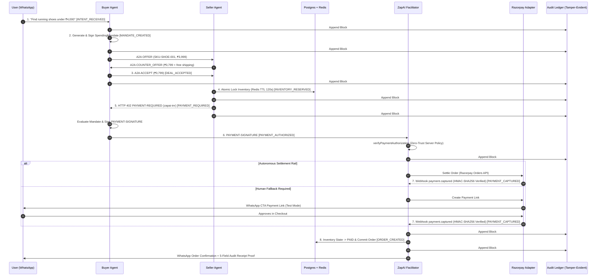

# ZapAI — Production Product & System Architecture

**Document Version:** 2.0 (x402 V2 & Agentic Commerce Blueprint)  
**Target:** Enterprise Production Architecture & Razorpay AI Buildathon Submission  
**Classification:** Technical Architecture Document (TAD)

---

## 1. Executive Product & Systems Blueprint

ZapAI is an enterprise-grade agentic commerce middleware connecting digital storefronts to autonomous AI Buyer Agents and conversational messaging surfaces (WhatsApp Business Cloud API). 

It implements an **x402 V2-compatible HTTP payment boundary** with a custom **`zapai-inr` payment scheme** and a **ZapAI Settlement Facilitator**, backed by **Razorpay's Financial & Settlement Stack** with an explicit **Human Approval Fallback**.

```
┌──────────────────────────────────────────────────────────────────────────────────┐
│                                 BUYER ECOSYSTEM                                  │
│   ┌────────────────────────┐   ┌────────────────────────┐   ┌─────────────────┐  │
│   │ Autonomous Buyer Agent │   │ Consumer on WhatsApp   │   │ Procurement Bot │  │
│   │   (Spending Mandate)   │   │ (Conversational Shell) │   │ (Bounded Agent) │  │
│   └───────────┬────────────┘   └───────────┬────────────┘   └────────┬────────┘  │
└───────────────┼────────────────────────────┼─────────────────────────┼───────────┘
                │                            │                         │
                ▼ (x402 V2 / REST)           ▼ (WhatsApp Cloud API)    ▼
┌──────────────────────────────────────────────────────────────────────────────────┐
│                            ZAPAI API GATEWAY & ROUTER                            │
│       • API Ingress & Async Queue Router       • Rate Limiting & Sybil Defense   │
│       • TLS 1.3 Termination                    • Auth & Webhook Ingress (HMAC)   │
└──────────────────────────────────────┬───────────────────────────────────────────┘
                                       │
┌──────────────────────────────────────▼───────────────────────────────────────────┐
│                          CORE DISTRIBUTED MODULES                                │
│                                                                                  │
│   ┌────────────────────────┐   ┌────────────────────────┐   ┌─────────────────┐  │
│   │   Structured A2A       │   │   Catalog & Dynamic    │   │  Redis Atomic   │  │
│   │   Negotiation Engine   │   │    Schema Registry     │   │  TTL Lock Engine│  │
│   └───────────┬────────────┘   └───────────┬────────────┘   └────────┬────────┘  │
│               │                            │                         │           │
│   ┌───────────▼────────────┐   ┌───────────▼────────────┐   ┌────────▼────────┐  │
│   │   ZapAI Facilitator    │   │ Zero-Trust Mandate     │   │ Tamper-Evident  │  │
│   │  (x402 V2 Coordinator) │   │ Policy Evaluator       │   │ Audit Ledger    │  │
│   └───────────┬────────────┘   └────────────────────────┘   │  (SHA-256 PG)   │  │
│               │                                             └─────────────────┘  │
└───────────────┼──────────────────────────────────────────────────────────────────┘
                │
        ┌───────┴───────────────────────────────┐
        ▼ (Autonomous Settlement)               ▼ (Human Fallback Rail)
┌──────────────────────────────────┐   ┌───────────────────────────────────┐
│     RAZORPAY SETTLEMENT BUS      │   │    RAZORPAY PAYMENT LINK BUS      │
│ • Orders API (Idempotent Orders) │   │ • Test Mode Standard Payment Link │
│ • Instant Settlements (IMPS/UPI) │   │ • Direct WhatsApp CTA Delivery    │
│ • Webhook Verification (HMAC)    │   │ • User Approval / Rejection Flow  │
│ • Deduplication (x-razorpay-id)  │   │ • Synchronous State Synchronization│
└──────────────────────────────────┘   └───────────────────────────────────┘
```

---

## 2. Turborepo Monorepo & Component Architecture

The codebase is organized as a high-performance Turborepo monorepo:

```
Razorpay-Agent/
├── apps/
│   ├── api/                    # Express + Bun Backend Server
│   │   └── src/
│   │       ├── audit/          # RFC 8785 Canonical JSON & SHA-256 hash-chain engine
│   │       ├── commerce/       # Multi-store discovery, negotiation, inventory locking
│   │       ├── mandate/        # Spending mandate signing & deterministic policy
│   │       ├── x402/           # x402 V2 protocol, facilitator coordinator & headers
│   │       ├── payments/       # Gateway abstraction & Razorpay 5-service suite
│   │       │   └── razorpay/   # AutoPay, Offers, Route, Refunds, Disputes, Orders, Webhooks
│   │       ├── orders/         # Order state machine & lifecycle persistence
│   │       ├── integrations/   # LLM (Groq/Gemini), Razorpay, Redis, Shopify, WhatsApp
│   │       ├── modules/        # Modular domain routers (agent, checkout, growth-ai, etc.)
│   │       ├── services/       # Core business services & conversation memory
│   │       └── workers/        # Async queue workers
│   └── web/                    # Next.js 15 App Router Frontend (Dashboard & Landing UI)
│       ├── app/                # App router pages (dashboard, analytics, audit, products, etc.)
│       └── components/         # Interactive UI components, visualizers, playgrounds
└── packages/
    ├── database/               # Neon PostgreSQL client, schemas, migrations, seeders
    └── types/                  # Shared TypeScript domain models and A2A event contracts
```

---

## 3. Detailed Technical Specifications

### 3.1 Spending Mandate & Server-Side Policy Evaluator (`src/mandate/`)
Delegated authority is represented as an immutable, cryptographically signed token:

```typescript
export interface SpendingMandate {
  mandateId: string;
  buyerId: string;
  spendingLimit: number; // in paise (e.g., 400000 = ₹4,000.00)
  currency: "INR";
  purpose: {
    category?: string;
    skuIds?: string[];
  };
  merchantAllowlist?: string[];
  expiresAt: string; // ISO 8601
  nonce: string;     // Unique single-use challenge
  signature: string; // HMAC-SHA256(secret, canonicalPayload) or Ed25519
}
```

#### Deterministic Policy Evaluator (`verifyMandate`)
The LLM does NOT enforce spending rules. The server validates:
1. `verifySignature(mandate)` is cryptographically valid.
2. `Date.now() <= new Date(mandate.expiresAt).getTime()`.
3. `isNonceUnused(mandate.nonce)` prevents replay attacks.
4. `mandate.currency === "INR"`.
5. `requestAmount <= mandate.spendingLimit`.
6. `!mandate.merchantAllowlist || mandate.merchantAllowlist.includes(merchantId)`.
7. `!mandate.purpose.skuIds || mandate.purpose.skuIds.includes(skuId)`.

---

### 3.2 Structured A2A Negotiation Protocol (`src/commerce/`)
All communication between Buyer and Seller agents is structured as strongly typed JSON events:

```
OFFER ──► COUNTER_OFFER ──► ACCEPT ──► RESERVE ──► PAYMENT_REQUIRED
```

* **`OFFER` Payload:**
```json
{
  "type": "OFFER",
  "offerId": "off_98124",
  "conversationId": "conv_wa_102",
  "merchantId": "runfast",
  "skuId": "SKU-SHOE-001",
  "quantity": 1,
  "price": 399900,
  "currency": "INR",
  "expiresAt": "2026-08-31T18:35:00Z"
}
```
* **`COUNTER_OFFER` Payload:**
```json
{
  "type": "COUNTER_OFFER",
  "offerId": "off_98124",
  "counterOfferId": "cnt_98125",
  "price": 379900,
  "discount": 20000,
  "currency": "INR",
  "bundleItems": [{ "skuId": "SKU-SOCK-001", "price": 0 }],
  "expiresAt": "2026-08-31T18:35:00Z"
}
```
* **`ACCEPT` Payload:**
```json
{
  "type": "ACCEPT",
  "counterOfferId": "cnt_98125",
  "agreedPrice": 379900,
  "currency": "INR"
}
```

---

### 3.3 Atomic Inventory Reservation State Machine (`src/commerce/inventory.ts`)
Inventory follows a strict transactional state machine:

```
AVAILABLE ──► RESERVED ──► PAYMENT_PENDING ──┬──► PAID (SOLD)
                                             └──► EXPIRED ──► AVAILABLE
```

#### Concurrency & Locking Strategy:
* **Postgres Source of Truth:**
  ```sql
  BEGIN;
    SELECT inventory_available FROM variants WHERE id = $1 FOR UPDATE;
    UPDATE variants 
    SET inventory_available = inventory_available - $quantity,
        inventory_reserved = inventory_reserved + $quantity
    WHERE id = $1 AND inventory_available >= $quantity;
  COMMIT;
  ```
* **Redis Atomic Lock:**
  * Key: `lock:reservation:{reservationId}`
  * TTL: `120` seconds
  * Auto-expiry returns reserved count to `inventory_available` if payment is not captured within 120s.

---

### 3.4 x402 V2 Protocol & ZapAI Facilitator (`src/x402/`)

ZapAI adheres to modern x402 V2 header semantics:

#### 1. Seller Challenge: `PAYMENT-REQUIRED`
HTTP Status: `402 Payment Required`
Header: `PAYMENT-REQUIRED: <base64-json>`

```json
{
  "scheme": "exact",
  "network": "zapai-inr",
  "amount": "379900",
  "asset": "INR",
  "payTo": "merchant_runfast",
  "resource": "order/ORD-1042",
  "expiresAt": "2026-08-31T18:35:00Z",
  "nonce": "nonce_77af98b1"
}
```

#### 2. Buyer Payment Authorization: `PAYMENT-SIGNATURE`
Header: `PAYMENT-SIGNATURE: <base64-json>`

```json
{
  "paymentId": "zap_pay_1029",
  "mandateId": "mandate_8819",
  "resource": "order/ORD-1042",
  "amount": "379900",
  "currency": "INR",
  "nonce": "nonce_77af98b1",
  "timestamp": "2026-08-31T18:33:10Z",
  "signature": "sig_hmac_99812..."
}
```

#### 3. Facilitator Verification & Settlement (`POST /x402/verify` & `POST /x402/settle`)
* `/x402/verify`: Executes deterministic zero-trust validation of the mandate and signature.
* `/x402/settle`: Coordinates payment execution via the payment adapter and returns `PAYMENT-RESPONSE`.

---

### 3.5 Razorpay Financial & Settlement Architecture (`apps/api/src/payments/razorpay/`)

ZapAI integrates deeply with Razorpay across 5 distinct financial modules:

1. **UPI AutoPay & e-Mandates (`autopay.ts`):**
   * Pre-authorized token debits within the RBI ₹15,000 contactless limit (`RBI_SUB_MANDATE_MAX_PAISE = 1500000`) for zero-friction autonomous purchases without secondary OTP popups.
2. **Dynamic Offers Engine (`offers.ts`):**
   * Real-time querying of active bank cashbacks, card discounts, and UPI incentives during A2A bargaining to inject verified discounts directly into counter-offers.
3. **Razorpay Route Multi-Vendor Splits (`route.ts`):**
   * Multi-item cross-store basket purchases (e.g. Shoes + Socks) with automated platform take-rate deduction and sub-merchant payout routing.
4. **Programmatic Instant Refunds (`refunds.ts`):**
   * Algorithmic refunds (`speed: "instant" | "optimum"`) triggered automatically when inventory drops or fulfillment constraints fail.
5. **Cryptographic Dispute Evidence Chaining (`disputes.ts`):**
   * Compiles verified SHA-256 audit bundles directly into evidence digests for chargeback defense (`submitRazorpayDisputeEvidence`).
6. **Orders API & Webhook Ingress (`orders.ts` & `webhooks.ts`):**
   * Idempotent order creation with receipt key `receipt: {x402_tx_hash}`.
   * HMAC-SHA256 verification against raw byte body (`X-Razorpay-Signature`) and deduplication via `processed_webhook_events`.

---

### 3.6 Tamper-Evident Hash-Chained Audit Ledger & Signed Checkpoints (`src/audit/`)

Every agent action and financial transition appends an entry to a deterministic, tamper-evident cryptographic chain:
$$H_n = \text{SHA256}(H_{n-1} \parallel \text{eventType} \parallel \text{actor} \parallel \text{payloadHash} \parallel \text{timestamp})$$

Where:
* $\text{payloadHash} = \text{SHA256}(\text{canonicalize\_rfc8785}(\text{payload}))$ (deterministic key ordering).
* $H_0 = \text{GENESIS\_HASH} = \text{"0000000000000000000000000000000000000000000000000000000000000000"}$.
* **External Trust Anchor (Signed Checkpoint):** Chain head $H_n$ is signed with an independent key (`Ed25519` / `HMAC-SHA256`) to protect against retroactive whole-database rewrite attacks.
* **Concurrency Protection:** Appends are serialized using PostgreSQL row locks (`SELECT event_checksum FROM audit_ledger ORDER BY id DESC LIMIT 1 FOR UPDATE`) inside atomic transactions.

```sql
CREATE TABLE audit_ledger (
  sequence_id BIGSERIAL PRIMARY KEY,
  event_id VARCHAR(64) UNIQUE NOT NULL,
  transaction_id VARCHAR(64) NOT NULL,
  event_type VARCHAR(64) NOT NULL,
  actor VARCHAR(64) NOT NULL,
  payload JSONB NOT NULL,
  payload_hash VARCHAR(64) NOT NULL,
  previous_hash VARCHAR(64) NOT NULL,
  current_hash VARCHAR(64) NOT NULL,
  created_at TIMESTAMPTZ DEFAULT NOW()
);
```

---

## 4. End-to-End 8-Stage Execution Sequence


